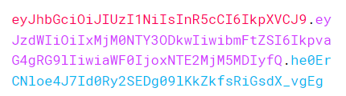
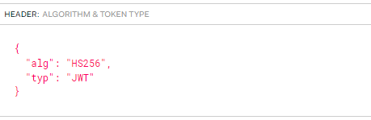
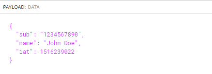
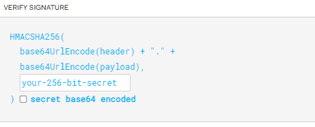

### TOC

# JWT
## 📌JWT란 무엇인가 
- JSON Web Token의 줄임말로 당사자 간에 정보를 안전하게 전송하기 위한 방식을 json 객체이다.
- 디지털 서명이 되어 있어 확인하고 신뢰할 수 있다.
- 정보를 안전하게 전할 때 혹은 유저의 권한을 체크하기 위해 사용하는데 유용한 모듈 이다.

## 📌JWT 구조
[https://jwt.io/](https://jwt.io/)에 가면 jwt 토큰을 만들어 볼 수 있다.  
JWT는 아래와 같이  `xxxx.yyyy.zzzz` 세 구조로 나뉜다.   

### header

- 헤더는 일반적으로 token 타입과 HMAC SHA256 RSA 와 같이 사용되는 signing 알고리즘의 정보가 표시된다.
- 이러한 json객체를 base64url로 인코딩하여 jwt의 첫번째 부분을 형성한다.
- 토큰에 대한 메타 데이터들이 들어간다.

### payload

- claim 들이 포함된다.
- claim (클레임)이란  엔티티(일반적으로 사용자)와 추가 데이터에 대한 설명이다.
- Register claims
    - 미리 정의 된 클레임
    - iss,exp,sub,aud 등이 있다.
    - 간결하게 사용하기 위해 3글자로 정의한다.
- Public claims
    - 사용하는 사람들이 원하는 대로 정의
    - 충돌을 피하기 위해 IANA JWT Registry에 정의 되거나 ,충돌에 저항력이 있는 네임스페이스를 포함하는 URL로 정의 되어야한다.
        - 충돌이란 , 두 개 이상의 요소가 동일한 식별자를 공유할 때 발생하는 문제이다.
        - IANA 는 인터넷에서 사용되는 프로토콜 파라미터를 중앙에서 관리하는 기관이다.
        - INAN JSON Registry에서 JWT에서 사용하는 공개 클래임 이름들을 모아둔 목록이다.
        - **"[http://mywebsite.com/jwt/claims/user_level"](http://mywebsite.com/jwt/claims/user_level%22%EA%B3%BC)**  같은 형태로 공개 클레임을 정의할 수 있다. (해당 네임스페이스 내에서만 유효하므로 다른 시스템과 충돌하지 않게됨)
- Private claims
    - 사용에 동의한 당사자간 정보를 공유하기 위해 만든 맞춤형 클레임
- Base64URL로 인코딩 되어 두번 째 부분을 형성한다.
- 서명된 토큰은 변조로부터 보호되지만 누구나 읽을 수 있으므로 payload나 header 요소에 암호화 되지 않은 비밀 정보를 넣지 말아야한다.
    - signed token : 서명된 토큰 : jwt에 디지털 서명이 추가되었음을 윔
    - 디지털 서명은 메시지의 무결성과 발신자의 신원을 검증하는데 사용
    - 토큰이 발행자에 의해 생성된 것임을 확인하고 전송과정에서 데이터가 변조되지 않았음을 보장

### signature

- 인코딩된 헤더, 인코딩된 페이로드, 비밀키 , 헤더에 명시된 알고리즘을 사용하여 서명을 한다.
- 서명은 메시지가 중간에 변경되지 않았음을 검증하는데 사용한다,
- 개인키로 서명된 토큰의 경우 jwt의 발신자가 자신이 주장하는 주체임을 검증할 수 있다

### 📌정리
1. header에는 어떠한 알고리즘이 사용되었는지 정보가 들어간다.
2. payload에는 실제 전달하려는 데이터가 들어간다.
3. signature에서 위의 정보들이 변조되지 않았다는 것을 확인하기 위해 header와 payload를 이용해서 생성한 값이 들어간다.

## 📌JWT 동작 방식

- 인증에서 사용자가 자신의 자격 증명을 사용하여 성공적으로 로그인하면 JSON Web Token이 반환된다.
- 토큰은 자격 증명이므로, 일반적으로 필요한 것보다 더 오래 토큰을 유지해서는 안된다.
- 보안이 부족하기 때문에 브라우저 저장소에 민감한 세션 데이터를 저장해서는 안 된다.
- 사용자가 보호된 경로나 리소스에 접근하려 할 때마다, 사용자 에이전트는 일반적으로 Bearer 스키마를 사용하여 Authorization 헤더에서 JWT를 전송해야 한다.
    - `Authorization: Bearer <token>`
- 특정 경우에 stateless 인증 매커니즘이 될 수 있다.
    - 상태 정보를 저장하지 않아도 되므로 무상태라 할 수 있다.
    - 클라이언트 요청마다 JWT(인증정보)가 함께 오기 때문에 서버 측에서는 별도의 세션 관리 없이 해당 요청을 처리할 수 있다.
- JWT에 많은 정보가 들어갈 경우 크기가 커져 문제가 발생 할 수 있어 최소한의 정보만 담아서 사용해야한다.
- CORS(도메인간 리소스 공유 시 발생할 수 있는 보안 이슈) 문제에 사용될 수 있다.
    - JWT는 쿠키와 달리 도메인 간 공유에 제약 받지 않는다.

1. 클라이언트에서 사용자가 로그인등을 할 때  OpenID Connect 같은 프로토콜을 따르면 '/oauth/authorize'와 같은 엔드포인트로 요청하며 이 과정에서 **authorization code flow** 등의 방식으로 진행될 수 있다
| authorization code flow : oauth2.0 인증 프로토콜에서 일반적으로 사용되는 인증 방식이다. 
2. 사용자가 성공적으로 인증하면 서버 쪽에서 JWT 형태의 access token을 발급하여 클라이언트에 전달해준다.
3. 그 후 클라이언트에서 서버로 요청할 때 마다 해당 access token(JWT)를 함께 보내주게 되고, 서버 쪽에서 해당 JWT가 유효한 지 검사하여 요청 유형(API 호출 등)에 따른 권한 확인 및 처리 등을 진행하게 된다.

- JWT의 payload 부분은 Base64 형태로 인코딩 되므로 실제 데이터가 외부에 노출될 수 있어서 민감한 정보는 JWT 내에 넣어서는 안 된다.

## 📌왜 JWT을 사용해야 하는가

1. JSON은 XML보다 간결하여 인코딩될 때 크기가 더 작아, JWT는 SAML보다 더 컴팩트하다. 이로 인해 JWT는 HTML과 HTTP 환경에서 전달하기에 좋다.
2. 보안 측면에서 SWT는 HMAC 알고리즘을 사용하여 공유 비밀로만 대칭적으로 서명될 수 있지만, JWT와 SAML 토큰은 X.509 인증서 형태의 공개/비공개 키 쌍을 사용하여 서명할 수 있다.
3. 대부분의 프로그래밍 언어에서 JSON 파서를 일반적으로 사용하며, 이것들은 직접 객체로 매핑 된다.반면 XML은 자연스러운 문서-객체 매핑이 없어 JWT를 다루기가 더 쉽다.
4. JWT는 인터넷 규모에서 사용되며, 여러 플랫폼(특히 모바일)에서 클라이언트 측 JSON 웹 토큰 처리의 용이성을 강조한다.
5. 인코딩된 JWT와 SAML의 길이를 비교하면, JWT가 더 짧고 관리하기 쉽다.

> 참고 : https://jwt.io/introduction

