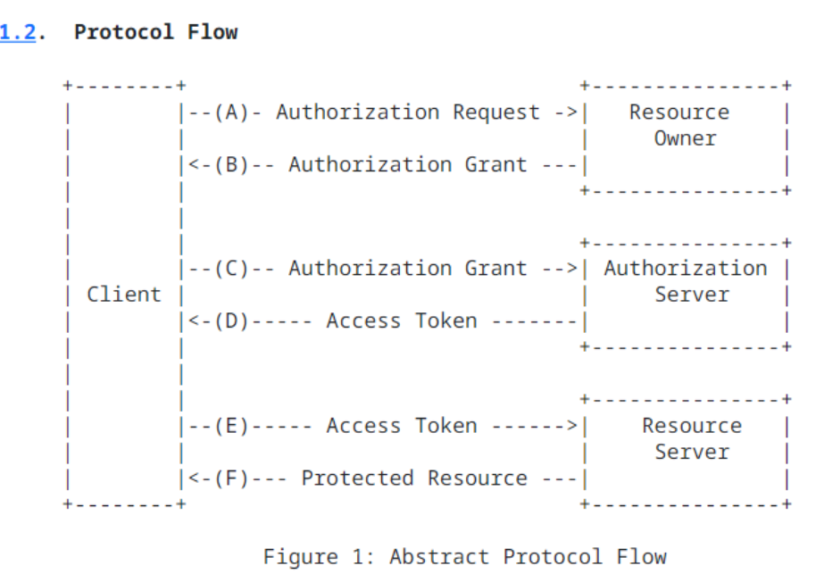
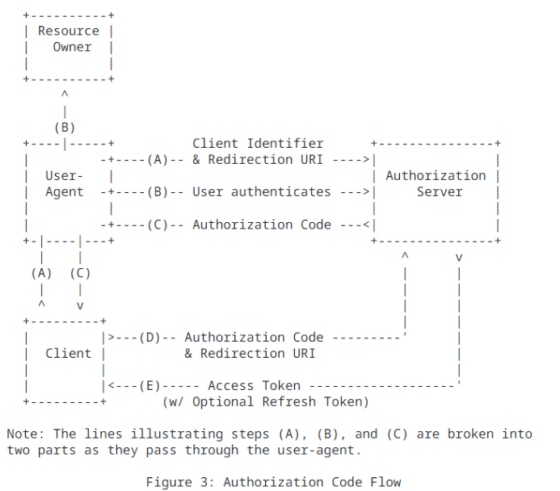

### TOC

## 📌 OAuth 2.0 
OAuth 2는 페이스북, 깃허브, 구글과 같은 응용 프로그램들이 HTTP 서비스에서 사용자 계정에 대한 제한된 접근을 얻을 수 있도록 하는 권한 부여 프레임워크이다.

## 📌 역할

### client
- 사용자의 계정에 접속할려는 프로그램  
- 리소스 서버에 접속해서 자원을 가져간다.  
ex) 우리가 만든 서비스  
### Resource Owner
- 리소스 소유자는 자신의 계정 일부에 액세스 권한을 부여하는 사용자  
- ex) user  
### Resource Server  
- 사용자의 정보에 접근하려는 api  
- 데이터를 가지고 있는 서버   
- ex) facebook,google 데이터 서버  
### Authorization Server
- 인증과 관련된 데이터를 처리하는 서버   
- 사용자가 요청을 승인하거나 거부하는 인터페이스를 제공하는 서버  
- 소규모 구현에서는 api 서버와 동일한 서버일 수 있지만 대규모 구현에서는 별도의 구성 요소로 구축되는 경우가 많다.
ex) facebook,google 인증 서버 
## 📌 authentication(인증)과 authorization(인가)의 차이
### 인증
- 사용자가 자신을 식별하는 프로세스
- "누구"인지 확인하고 사용자의 신원을 확인한다.
- ex)  사용자가 로그인하고 자신의 아이디와 비밀번호를 제공하여 시스템에 로그인할 때 이루어지는 과정
### 인가
- 인증 후 어떤 작업이나 자원에 대한 접근 권한을 부여하거나 거부하는 프로세스
- "무엇"에 대한 엑세스 권한을 관리한다.
- ex) 로그인 후에 특정 파일에 대한 읽기 또는 쓰기 권한을 얻는 과정

## 📌 Abstract Protocol Flow 


(A) client는 resource owner에게 권한을 요청한다.   
(B) resource owner가 권한 요청을 승인하면 client는 권한 부여를 받는다.   
(C) client는 자신의 신원에 대한 인증을 제시함으로써 authorization server에 엑세스 토큰을 요청하고 ,인가 허가를 받는다.  
(D) client id가 인증되고 인가 허가가 유효한 경우 , authorization server는 client에 엑세스 토큰을 발행한다.   
(E) client 는 resource server에 리소스를 요청하고 인증을 위한 엑세스 토큰을 제시한다.  
(F) 엑세스 토큰이 유효한 경우 resource server는 리소스를 client에게 제공한다.  

: 실제 과정은 권한 부여 유형에 따라 다르지만 일반적인 과정이다  

## 📌등록

OAuth를 사용하기 전에 애플리케이션을 서비스에 등록해야한다.등록할 때 주로 애플리케이션 이름과 웹사이트 등 기본정보를 입력한다. 또한 사용자를 리디렉션할 redirect url를 등록해야한다.  
### Redirect URLs
등록한 url로만 리디렉션하여 일부 공격을 방지하는데 도움이 된다.  
redirect url는 https를 통해 제공되며 이를 통해 인증 과정에서 토큰이 가로채지는 것을 방지할 수 있다.  

### Client ID and Secret
애플리케이션을 등록하면 client ID와 client secret을 받게 된다. client id는 공개 정보이며 로그인 url을 구축하는데 사용되거나 페이지의 자바스크립트 소스 코드에 포함된다. client secret은 반드시 비밀로 유지되어야한다. 


## 📌Authorization Grant
- 위 abstract protocol flow의 처음 4단계는 인가부여와 엑세스 토큰을 얻는것을 다룬다.
- authorization grant 유형은 애플리케이션이 인가를 요청하는 방법과 api가 지원하는 허가 요청에 따라 달라진다.
- ouath2는 세가지 주요 허가 유형이 있다.
  1. Authorization Code : 서버 측 애플리케이션에서 사용된다.
  2. Client Credentials : api 엑세스 권한이 있는 애플리케이션에서 사용된다.
  3. Device Code : 브라우저가 없거나 입력 제한이 있는 장치에서 사용된다.
### ✨Authorization Code
- 소스 코드가 공개적으로 노출되지 않는 server-side 애플리케이션에 최적화 되어있다.
- HTTP 리다이렉션을 토해 resource owner가 직접 코드를 획득하는 방식이다.
- 가장 대표적으로 사용된다.

#### Step 1 - Authorization Code link
```
https://example.com/login/oauth/authorize?client_id=YOUR_CLIENT_ID&redirect_uri=YOUR_REDIRECT_URI&scope=SCOPE&response_type=code
```
resource owner에게 다음과 같은 링크를 준다.  
`https://example.com/login/oauth/authorize**` : api 승인 엔드 포인트
`client_id=YOUR_CLIENT_ID` : client id
`redirect_uri=YOUR_REDIRECT_URI` : 인증 코드가 부여된 뒤 리다이렉트 할 url
`response_type=code` : 애플리케이션이 인증 코드 부여을 요청하고 있음을 지정한다.
`scope=SCOPE` : 애플레케이션이 요청하는 엑세스 수준을 지정한다.

#### Step 2 - 사용자가 애플리케이션을 승인한다.
- 사용자가 링크를 클릭하면 서비스에 로그인하여 본인의 신원을 인증해야한다. 서비스는 애플리케이션에 대한 접근을 승인하거나 거부하도록 서비스에 의해 요구된다.
#### Step 3 - 애플리케이션이 authorization code을 받는다.
```
https://example.com/callback?code=AUTHORIZATION_CODE
```
- 서비스는 authorization code와 함께 등록 된 애플리케이션 리디렉션 URI로 리디렉션한다.
#### Step 4 - 애플리케이션은 엑세스 토큰을 요청한다.
```
https://example.com/login/oauth/token?client_id=CLIENT_ID&client_secret=CLIENT_SECRET&grant_type=authorization_code&code=AUTHORIZATION_CODE&redirect_uri=CALLBACK_URL
```
- 애플리케이션은 client secret을 포함한 인증 정보와 함께 인증 코드를 api 토큰 엔드포인트로 전달함으로써 api로부터 엑세스 토큰을 요청한다. 
#### Step 5 - 애플리케이션이 엑세스 토큰을 받는다.
```json
{
	"access_token":"ACCESS_TOKEN",
	"token_type":"bearer",
	"expires_in":2592000,
	"refresh_token":"REFRESH_TOKEN",
    "scope":"read",
    "uid":100101,
    "info":{.....}
}
```
- 인가가 유효한 경우 api는 엑세스 토큰을 포함하는 응답을 보낸다.
- 토큰을 사용하여 토큰이 만료되거나 취소될 때 까지 api를 통해 사용자 계정에 접근할 수 있다.
- 리프레쉬 토큰이 발행된 경우, 원래 토큰이 만료된 경우 새로운 엑세스 토큰을 요청하는 사용할 수 있다.
#### 정리 
```
1.  클라이언트 애플리케이션은 사용자를 인증 서버의 로그인 페이지로 리다이렉트한다. 이 페이지에서 사용자는 자신의 아이디와 비밀번호를 입력하여 로그인한다.
2. 사용자가 로그인에 성공하면, 인증 서버는 클라이언트 애플리케이션에 대한 권한을 사용자에게 요청한다.
3. 사용자가 클라이언트 애플리케이션의 접근을 허용하면, 인증 서버는 사용자를 클라이언트 애플리케이션으로 리다이렉트한다. 이 리다이렉트 URL에는 "인증 코드"가 포함되어 있다.
4. 클라이언트 애플리케이션은 이 인증 코드를 인증 서버에 제출한다. 클라이언트 애플리케이션은 자신의 클라이언트 아이디와 시크릿을 함께 제출하여 자신을 인증한다.
5. 인증 서버는 클라이언트 애플리케이션을 인증하고, 인증 코드를 확인한 후, 액세스 토큰을 클라이언트 애플리케이션에게 발급한다.
```

### ✨Client Credentials
- 애플리케이션이 서비스 계정에 접근할 수 있는 방법을 제공한다.
- 애플리케이션 자체가 사용자를 대신하여 api에 접근해야할 때 사용된다.
```
https://example.com/token?grant_type=client_credentials&client_id=CLIENT_ID&client_secret=CLIENT_SECRET

```
1. 애플리케이션은 client id와 client secret를 사용하여 인증 서버에 액세스 토큰을  HTTP POST 요청을 한다.
2. authorization server는 애플리케이션의 자격증명을 검증하고 자격증명이 유효하면 인증 서버는 액세스 토큰을 애플리케이션에 반환한다.
3. 애플리케이션은 이 토큰을 사용하여 API에 접근하고, 필요한 작업을 수행한다.
### ✨Device Code
- 브라우저가 부족하거나 입력이 제한된 디바이스들이 엑시스 토큰을 획득하고 사용자 계정에 접근하기 위한 수단을 제공한다.
- 스마트 텔레비전이나 비디오 게임 콘솔과 같은 키보드 입력이 없는 디바이스에서 유용하다.
```
POST https://oauth.example.com/device

client_id=CLIENT_id
```
```
{
  "device_code": "IO2RUI3SAH0IQuESHAEBAeYOO8UPAI",
  "user_code": "RSIK-KRAM",
  "verification_uri": "https://example.okta.com/device",
  "interval": 10,
  "expires_in": 1600
}
```

> 참고  
https://www.digitalocean.com/community/tutorials/an-introduction-to-oauth-2#client-credentials-flow  
https://aaronparecki.com/oauth-2-simplified/#others  
https://datatracker.ietf.org/doc/html/rfc6749  
